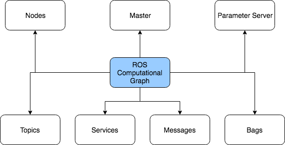

# ROS Introduction

A brief introduction of the ROS system.

## Overview

The ROS architecture consists of three levels of concepts:

1. Filesystem Architecture
2. Computational Graph
3. Community

Let's have a brief look at each of these levels.

### Filesystem Architecture

Consists of concepts which tell how a ROS system is formed, including its
folder structure and the minimum number of files it needs to work with.

* Useful Commands : rospack, catkin_create_pkg, catkin_make, rosdep, roscd,
rosed, roscp, rosd, rosls

### Computational Graph

Provides information about how various components in a ROS project come
together to perform an action. Primarily, this level tells us how ROS sets up
and handles the communication between various processes.

* Useful Commands : roscore, rosnode, rostopic, rosrun, rosservice, rosmsg, rosbag

### Community

ROS community is an active open-source organisation sharing knowledge,
algorithms, code packages from any developer. It allows us to _overlay_ and
experiment a package from one developer on top of our developed packages. These
resources include:

* Distributions : Similar to Linux distributions or Windows OS versions, ROS
distributions provide updates made to its core-system by the community.

* Repositories : ROS' federated network of institutions or organisations develop
and release their own robotics components as repositories, e.g. cartographer

* The ROS Wiki : Contains documentation about ROS and provides a forum for the
ROS community to contribute via documentation updates, tutorials, etc.

* Bug Ticket System : Way to enable ROS users to apply bug-fixes on any of the ROS
codebase. Currently this is done via pull-requests on respective Git repositories.

* Mailing List : `ros-users` mailing list provides regular updates on ROS.

* ROS Answers : Question-Answer forum where users are enc.ouraged to ask and answer
questions; [answers.ros.org](http://answers.ros.org).

* Blog : Regular photos, updates and news articles about ROS could be found at
 [ROS news](http://ros.org/news)

## References

1. ROS Concepts : http://wiki.ros.org/ROS/Concepts

2. ROS Cheat Sheets
    * Clearpath Robotics Inc. : https://www.clearpathrobotics.com/ros-robot-operating-system-cheat-sheet/

    * James Madison University Robotics Lab : https://w3.cs.jmu.edu/spragunr/CS354/handouts/ROSCheatsheet.pdf
